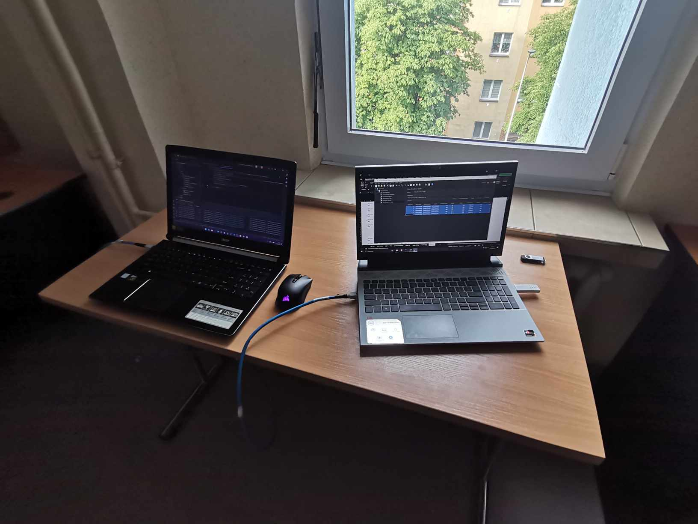

# PSISK_PROJECT
# Badanie wydajności wybranych technologii wykorzystywanych w architekturze mikroserwisowej

## Wstęp
Architektura mikroserwisowa zyskuje na popularności dzięki swojej elastyczności, skalowalności i możliwości łatwego zarządzania poszczególnymi komponentami aplikacji. W ramach tej pracy zbadamy wydajność wybranych technologii komunikacyjnych stosowanych w tej architekturze, mianowicie SOAP oraz REST API.

## SOAP
SOAP (Simple Object Access Protocol) to protokół komunikacyjny wykorzystywany do przekazywania informacji pomiędzy różnymi aplikacjami. Jest oparty na języku XML i działa na zasadzie klient-serwer, gdzie klient wysyła zapytanie HTTP z informacjami na temat tego, czego oczekuje od serwera. Serwer odbiera to zapytanie, przetwarza je i wysyła odpowiedź zawierającą poszukiwane przez klienta dane.

### Struktura SOAP
Struktura danych w protokole SOAP opiera się na hierarchicznych elementach XML. Każde żądanie i odpowiedź przekazywane za pomocą SOAP składa się z trzech części: nagłówka, ciała zawierającego komunikat oraz stopki. Dane są pakietowane w formacie XML i wysyłane z użyciem protokołu HTTP.

### Mechanizmy bezpieczeństwa
SOAP dostarcza kompleksowych mechanizmów bezpieczeństwa:
- Podpisywanie cyfrowe
- Szyfrowanie danych
- Uwierzytelnianie
- Zarządzanie uprawnieniami
- Ochrona przed atakami

### Zalety i wyzwania SOAP
Zalety:
1. Interoperacyjność
2. Bezpieczeństwo
3. Rozszerzalność
4. Bezstanowość
5. Obsługa różnych protokołów transportowych
6. Wszechstronność

Wyzwania:
1. Złożoność
2. Wydajność
3. Kompatybilność
4. Rozmiar danych
5. Skalowalność

## REST API
REST (Representational State Transfer) to styl architektury oprogramowania, który definiuje zestaw zasad dla tworzenia rozproszonych systemów. RESTful API (Application Programming Interface) umożliwia komunikację między klientami a serwerami za pomocą standardowych protokołów sieciowych, takich jak HTTP.

### Architektura REST
Architektura REST skupia się na zasobach, reprezentacjach zasobów, interakcjach klienta-serwer oraz bezstanowości. Zasoby są identyfikowane za pomocą URI (Uniform Resource Identifier) i manipulowane za pomocą standardowych operacji HTTP, takich jak GET, POST, PUT i DELETE. Każdy zasób może mieć różne reprezentacje, takie jak XML, JSON lub HTML, które są przesyłane między klientem a serwerem.

### Zastosowanie REST API
RESTful API znajduje zastosowanie w różnych obszarach:
- Tworzenie interfejsów użytkownika w aplikacjach internetowych
- Integracja systemów
- Rozwijanie mikroserwisów
- Tworzenie aplikacji mobilnych

### Wyzwania związane z REST API
Wyzwania:
- Złożoność konfiguracji
- Bezpieczeństwo
- Zarządzanie wersjami
- Wydajność

## Badania
Do badania wydajności mikroserwisów z wykorzystaniem protokołów SOAP i REST API użyto programu JMeter. Za każdym razem w pierwszej kolejności odbywał się pomiar 5 próbek a następnie 100.

### Program JMeter
Apache JMeter to narzędzie do testowania wydajności aplikacji. Umożliwia symulację ruchu sieciowego, testowanie aplikacji webowych oraz monitorowanie wydajności serwerów. JMeter pozwala na tworzenie różnych scenariuszy testowych, generowanie raportów i analizowanie wyników.

### Kabel
Kabel Scharck CAT 6a U/FTP (Unshielded Foiled Twisted Pair) to wysokiej jakości przewód, przeznaczony do transmisji danych w zaawansowanych sieciach komputerowych. Oferuje przepustowość do 10 Gbps przy maksymalnej częstotliwości 500 MHz, co sprawia, że jest idealny do aplikacji wymagających wysokiej szybkości transmisji danych, takich jak serwery, switchy i inne urządzenia sieciowe.

Kabel Scharck CAT 6a U/FTP charakteryzuje się konstrukcją Unshielded Foiled Twisted Pair, gdzie każda para przewodów jest owinięta folią aluminiową. Takie rozwiązanie znacząco zwiększa odporność na zakłócenia elektromagnetyczne (EMI) i przesłuchy (crosstalk), co jest istotne w środowiskach o wysokim poziomie zakłóceń. Zewnętrzny płaszcz kabla wykonany z wytrzymałego tworzywa gwarantuje ochronę przed uszkodzeniami mechanicznymi i wpływami środowiska, co jest szczególnie ważne w przypadku instalacji wymagających trwałości.

### Stanowisko Badawcze
Stanowisko badawcze pozwala na przeprowadzenie bezpośrednich testów wydajnościowych, pomiarów przepustowości oraz analizę zachowania sieci przy użyciu różnych protokołów i konfiguracji. Stanowisko składa się z dwóch komputerów połączonych bezpośrednio za pomocą kabla krosowanego CAT 6, co umożliwia przesył danych z maksymalną przepustowością do 10 Gbps przy częstotliwości do 500 MHz. 

Takie połączenie jest idealne do testowania aplikacji sieciowych, serwerów oraz innych urządzeń sieciowych w kontrolowanym środowisku. Testy przeprowadzane na tym stanowisku dostarczają cennych danych na temat opóźnień, przepustowości oraz odporności na zakłócenia, co jest kluczowe dla rozwoju i optymalizacji nowoczesnych rozwiązań sieciowych.

Na zdjęciu można zobaczyć faktyczne ustawienie sprzętu używanego w eksperymentach. Dwa laptopy wyposażone w oprogramowanie JMeter umożliwiają dokładne monitorowanie i analizę przesyłanych danych, co jest nieocenione w badaniach nad efektywnością sieci komputerowych.

### Badanie dla poszczególnych protokołów

#### Badanie wydajności mikroserwisów za pomocą HTTP

W ramach badania wydajności mikroserwisów za pomocą protokołu HTTP, przeprowadzono testy wydajności dla różnych typów danych, w tym INT, STRING, SQL i LF, używając protokołów REST i SOAP. Wyniki są przedstawione w tabelach i wykresach poniżej.

##### INT (HTTP)
| Protocol | Sample Time (ms) | Bytes | Sent Bytes | Latency | Connect Time (ms) |
|----------|------------------|-------|------------|---------|-------------------|
| rest     | 3.8              | 234   | 155        | 3.4     | 0.2               |
| soap     | 11.4             | 530   | 484.2      | 11.2    | 0.4               |
| rest     | 4.25             | 233.71| 155        | 4.18    | 0.03              |
| soap     | 8.32             | 529.14| 484.42     | 8.3     | 0.02              |

*Interpretacja:* REST wykazuje niższy czas odpowiedzi i niższą latencję w porównaniu do SOAP, co sugeruje większą efektywność REST w lekkich operacjach HTTP.

##### STRING (HTTP)
| Protocol | Sample Time (ms) | Bytes | Sent Bytes | Latency | Connect Time (ms) |
|----------|------------------|-------|------------|---------|-------------------|
| rest     | 5                | 166   | 196        | 5       | 0.4               |
| soap     | 8.8              | 518   | 489        | 8.8     | 0.6               |
| rest     | 1.28             | 165.71| 196        | 1.28    | 0.01              |
| soap     | 8.74             | 518   | 489        | 8.68    | 0.02              |

*Interpretacja:* REST ponownie osiąga lepsze wyniki niż SOAP, co podkreśla jego przydatność dla prostych transakcji danych.

##### SQL (HTTP)
| Protocol | Sample Time (ms) | Bytes | Sent Bytes | Latency | Connect Time (ms) |
|----------|------------------|-------|------------|---------|-------------------|
| rest     | 20.8             | 348   | 133        | 20.4    | 0.4               |
| soap     | 18.33            | 626.67| 473.17     | 18.33   | 0.5               |
| rest     | 22.855           | 347.71| 133        | 22.81   | 0.02              |
| soap     | 16.42            | 629.68| 473.65     | 16.39   | 0.04              |

*Interpretacja:* SOAP wykazuje ogólnie niższą latencję i czas odpowiedzi w porównaniu do REST, co może sugerować, że dla bardziej złożonych zapytań bazy danych SOAP jest bardziej odpowiedni, zapewniając stabilniejsze i szybsze przetwarzanie danych.

##### LF (HTTP)
| Protocol | Sample Time (ms) | Bytes | Sent Bytes | Latency | Connect Time (ms) |
|----------|------------------|-------|------------|---------|-------------------|
| rest     | 27.8             | 237   | 980155.6   | 25.8    | 6                 |
| soap     | 68.2             | 583   | 1306775    | 68.2    | 1.6               |
| rest     | 15.25            | 208   | 980146.01  | 15.02   | 1.28              |
| soap     | 74.61            | 583   | 1306775    | 74.51   | 0.08              |

*Interpretacja:* REST okazuje się być znacznie bardziej efektywny w zakresie czasu odpowiedzi i latencji w porównaniu do SOAP. Mimo większych rozmiarów przesyłanych danych, REST demonstruje lepszą wydajność, co jest kluczowe przy transmisji dużych objętości danych.

